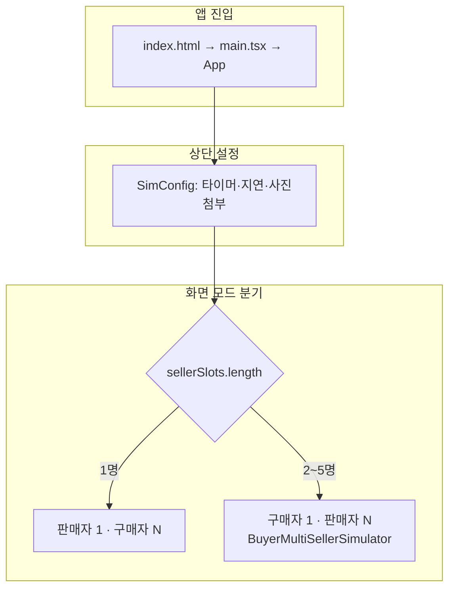
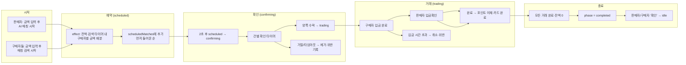
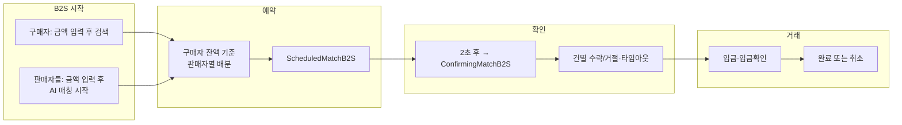
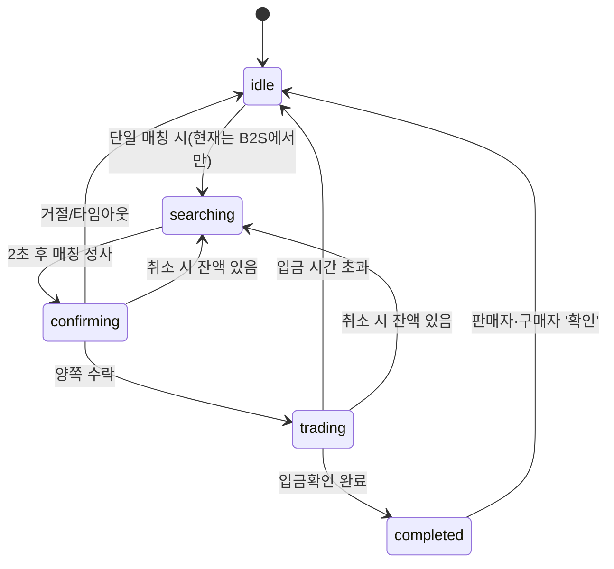
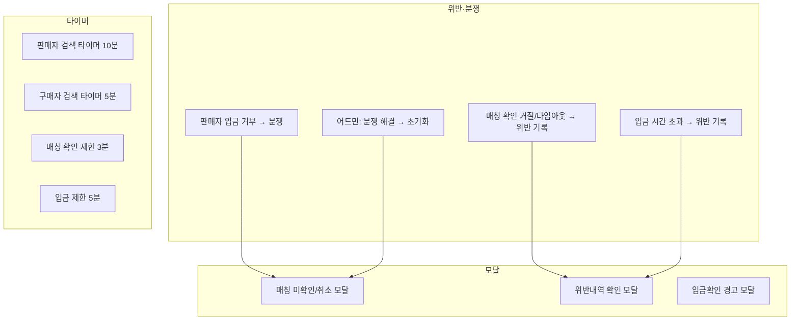

# NEWXMEM 프로젝트 흐름도

## 흐름도 이미지


**flow-main.png** — 앱 진입 → SimConfig → 판매자 수 분기(1명 vs 2~5명) 및 다중 동시 매칭 단계(시작→예약→확인→거래→완료→idle)


**flow-detail.png** — 다중 동시 매칭 상세: 금액 입력·검색 → scheduled → confirming(수락/거절) → trading(입금·입금확인) → 완료/취소 → completed → 확인 클릭 시 idle

이미지가 없으면 Cursor에서 생성된 `flow-main.png`, `flow-detail.png`가 있는 위치(예: `.cursor/projects/.../assets`)에서 아래처럼 복사하면 됩니다.

```bash
node scripts/copy-flow-images.cjs "경로\assets"
```

---

## 1. 앱 진입 및 모드 분기



- **판매자 1명** → App에서 구매자 1~5 + 판매자 1 화면 (다중 동시 매칭)
- **판매자 2~5명** → `BuyerMultiSellerSimulator` (B2S: 구매자 1명이 여러 판매자와 매칭)

---

## 2. 모드 A: 판매자 1명 · 구매자 N명 (다중 동시 매칭)



### 상태 흐름 요약 (판매자 1 · 구매자 N)

| 단계 | 상태 | 설명 |
|------|------|------|
| 1 | idle | 판매자 금액 입력, remainingAmount 설정, 구매자들 검색 시작 |
| 2 | scheduled | effect가 구매자별로 금액 배분 → `scheduledMatches` 추가 |
| 3 | confirming | 2초 후 건별로 `confirmingMatches` 이동, 건별 타이머·수락/거절 |
| 4 | trading | 양쪽 수락 건만 `tradingMatches` 이동, 입금·입금확인 |
| 5 | completed | 거래 중 건 없음 + 잔액 0 → phase `completed`, 이후 '확인' 시 idle |

---

## 3. 모드 B: 구매자 1명 · 판매자 N명 (B2S)



- `BuyerMultiSellerSimulator` 내부에서 동일한 패턴: **scheduled → confirming → trading**, 건별 타이머·수락/거절.

---

## 4. Phase 정의 (types.ts)



- **다중 동시 매칭(판매자 1 · 구매자 N)**에서는 전역 `phase`는 주로 `idle` ↔ `completed`만 사용하고, 건별 상태는 `scheduledMatches` → `confirmingMatches` → `tradingMatches`로만 관리됨.

---

## 5. 공통 부가 흐름



---

## 6. 파일별 역할

| 파일 | 역할 |
|------|------|
| `App.tsx` | SimConfig, 판매자 1·구매자 N 상태(scheduled/confirming/trading), 단일 매칭 phase, 핸들러 |
| `BuyerMultiSellerSimulator.tsx` | B2S(구매자 1·판매자 N) 전용 상태 및 UI |
| `SellerPhoneContent.tsx` | 판매자 화면 (검색/확인/입금확인/완료/다중 카드) |
| `BuyerPhoneContent.tsx` | 구매자 화면 (검색/확인/입금/완료/다중 카드) |
| `matchMock.ts` | User 생성, `computeMatchResult` (1:1 금액 계산) |
| `matchSound.ts` | 매칭 시 사운드 재생/중지 |

이 문서는 프로젝트 루트의 `docs/FLOW.md`에서 확인할 수 있습니다.
