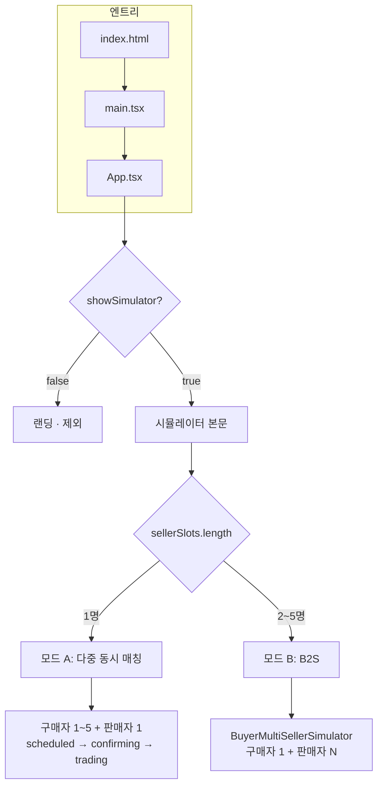
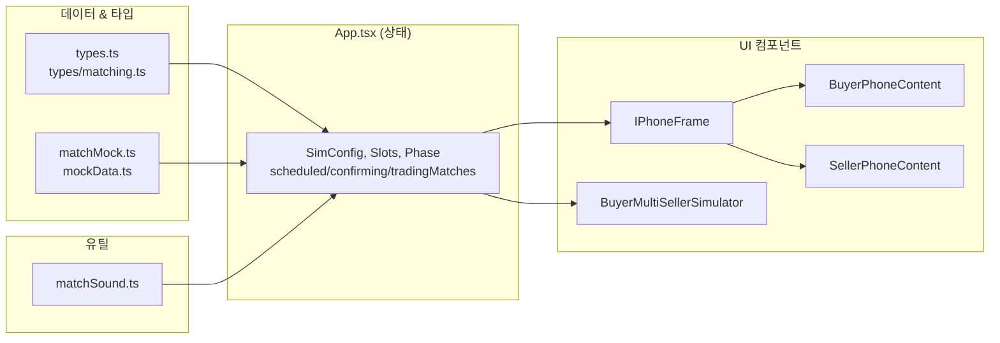
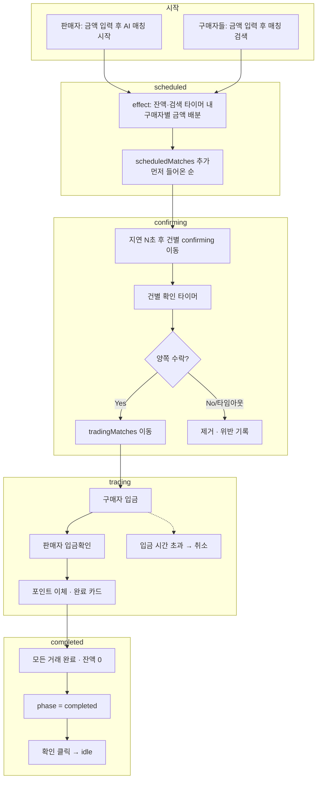
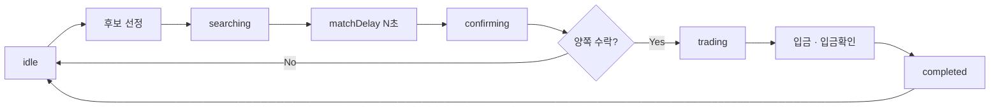
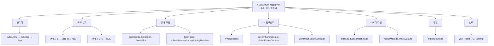

# NEWXMEM 프로젝트 마인드맵 (개발자용)

> **제외 영역**: 홈피(랜딩/소개 페이지), 어드민(타이머·지연 설정 패널, 분쟁 해결 버튼)  
> **대상**: 시뮬레이터 본문 + 데이터/타입/유틸/빌드

---

## 플로우차트 보는 방법

아래 Mermaid 블록(```mermaid ... ```)은 다음처럼 보면 됩니다.

| 환경 | 방법 |
|------|------|
| **GitHub** | 이 파일(`MINDMAP_DEV.md`)을 **GitHub에 푸시**한 뒤, 저장소에서 해당 파일을 열면 **자동으로 다이어그램이 렌더링**됩니다. (GitHub는 `.md` 안의 Mermaid를 기본 지원) |
| **Cursor / VS Code** | 1) 마크다운 미리보기 열기: `Ctrl+Shift+V` (Windows) 또는 `Cmd+Shift+V` (Mac) 2) 또는 **Markdown Preview Mermaid Support** 확장 설치 후 미리보기에서 차트 표시 |
| **온라인** | [Mermaid Live Editor](https://mermaid.live) 에 접속 → 문서에서 `flowchart` 블록만 복사해 붙여넣기 → 실시간 렌더링 확인 |

**요약**
- **GitHub**: 파일 올리고 브라우저에서 `docs/MINDMAP_DEV.md` 열기 → 스크롤하면 차트가 그림으로 보임.
- **에디터**: `Ctrl+Shift+V` 로 미리보기 열고, 지원이 안 되면 "Mermaid" 확장 설치.

---

## 1. 전체 구조 한눈에

```
NEWXMEM (홈피·어드민 제외)
├── 앱 엔트리 & 라우팅
├── 시뮬레이터 모드 분기
├── 상태 모델 (App 상태)
├── UI 컴포넌트
├── 데이터 & 타입
├── 유틸리티
└── 빌드·설정
```

---

## 2. 앱 엔트리 & 라우팅

- **index.html** → **main.tsx** → **App.tsx**
- `showSimulator` 상태
  - `false` → 랜딩(홈피) → **제외**
  - `true` → 실시간 매칭 시뮬레이터 본문
- 상단 "← 소개로 돌아가기"로 `showSimulator = false` 전환

---

## 3. 시뮬레이터 모드 분기

- **판매자 슬롯 수** `sellerSlots.length` 기준 분기
  - **1명** → **모드 A: 다중 동시 매칭**
    - 구매자 1~5 + 판매자 1
    - `useMultiSimultaneous === true`
    - 한 판매자에게 여러 구매자 동시 매칭 (scheduled → confirming → trading)
  - **2~5명** → **모드 B: B2S (BuyerMultiSellerSimulator)**
    - 구매자 1명이 여러 판매자와 매칭
    - `BuyerMultiSellerSimulator` 컴포넌트 사용
    - App 내 단일 매칭 로직은 사용 안 함

---

## 4. 상태 모델 (App.tsx)

### 4.1 설정 (SimConfig)

- `matchDelaySeconds`, `confirmDelaySeconds`
- `sellerSearchTimerMinutes`, `buyerSearchTimerMinutes`, `buyerDepositTimerMinutes`
- `confirmTimerSeconds`
- `buyerDepositPhotoEnabled`, `sellerDepositPhotoEnabled`  
※ UI에서 수정하는 패널은 어드민으로 제외, **값을 쓰는 로직**은 시뮬레이터 본문에 포함

### 4.2 판매자·구매자 슬롯

- **SellerSlot** (판매자 1명분)
  - `user`, `amount`, `remainingAmount`, `started`, `clickedNew`
  - `searchTimerSeconds`, `currentPoints`, `violationHistory`
- **BuyerSlot** (구매자 1명분)
  - `user`, `amount`, `started`, `depositDone`, `clickedNew`
  - `showCompletedScreen`, `lastCompletedAmount`, `searchTimerSeconds`
  - `currentPoints`, `matchConfirmed`, `violationHistory`

### 4.3 단계(Phase) & 단일 매칭

- **SimPhase**: `idle` | `searching` | `confirming` | `trading` | `completed`
- **단일 매칭**(판매자 1명 + 구매자 1명 플로우)
  - `matchResult`, `matchedBuyerIndex`, `sellerConfirmed`, `sellerMatchConfirmed`
  - `confirmTimerSeconds`, 취소/거절 관련 플래그·메시지

### 4.4 다중 동시 매칭 전용 상태

- **ScheduledMatch**: `matchId`, `buyerIndex`, `amount`, `scheduledAt`
- **ConfirmingMatch**: `matchId`, `buyerIndex`, `amount`, `confirmTimerSeconds`, `buyerConfirmed`, `sellerConfirmed`
- **TradingMatch**: `matchId`, `buyerIndex`, `amount`, `buyerDepositDone`, `sellerConfirmed`, `canceledReason?`
- **배열**: `scheduledMatches`, `confirmingMatches`, `tradingMatches`
- **표시 순서**: `matchDisplayOrder` (matchId[])
- **완료 목록**: `completedMultiMatches`
- **분쟁**: `activeDisputes` (표시·플로우 설명용, 해결 버튼은 어드민으로 제외)

### 4.5 기타 UI·플로우 상태

- 취소/거절 메시지: `sellerCancelMessage`, `buyerCancelMessage`, `buyerCancelMessageForIndex`
- `confirmingInvalidated`, `rejectReason`, `sellerRejectDepositReason` 등
- `transferModalMatchId`, `completedSoldAmount`

---

## 5. UI 컴포넌트

### 5.1 프레임

- **IPhoneFrame**
  - 구매자/판매자 폰 목업 프레임
  - `variant`: `'buyer'` | (판매자)
  - `title`, `titleAction` (+, − 버튼)

### 5.2 구매자·판매자 화면

- **BuyerPhoneContent**
  - 구매자 한 명 화면: 금액 입력, 검색, 매칭 확인, 입금, 거래 완료, 취소/거절/분쟁
  - phase, 타이머, 수락/거절/입금 불가 콜백 등
- **SellerPhoneContent**
  - 판매자 한 명 화면: 금액 입력, AI 매칭 시작, 확인 단계, 입금확인·거부, 거래 완료
  - 단일: `matchResult` 1건 / 다중: `multiOrderedMatches` (confirming·trading·completed 건별)

### 5.3 B2S 모드

- **BuyerMultiSellerSimulator**
  - 판매자 2~5명일 때만 사용
  - 구매자 1 + 판매자 N 레이아웃 및 매칭 플로우

### 5.4 시뮬레이터 내부 보조

- **HologramGrid**, **AIBot**: 시뮬레이터 내 장식/연출용 (필요 시만 노드로 표시)

---

## 6. 데이터 & 타입

### 6.1 타입 (types.ts)

- **User**: `id`, `name`, `creditScore`, `bank`, `accountNumber`, `holder`, `points`
- **SimPhase**: `idle` | `searching` | `confirming` | `trading` | `completed`
- **MatchStatus**: IDLE, SEARCHING, MATCHED, TRANSFERRING, COMPLETED
- **Participant**: 매칭된 상대 정보 (금액 포함)

### 6.2 타입 (types/matching.ts)

- **MatchType**: `'1:1'` | `'1:N'`
- **BankInfo**, **MemberProfile**, **MockMatchResult**

### 6.3 데이터 (data/matchMock.ts)

- **sellerSessionUser**, **buyerSessionUser** (데모용 고정 사용자)
- **createSellerUserForIndex(index)**, **createBuyerUserForIndex(index)**
- **computeMatchResult(sellerAmount, buyerAmount, sellerUser, buyerUser)** → 매칭 결과 객체

### 6.4 데이터 (data/mockData.ts)

- 기타 목업 데이터 (시뮬레이터/랜딩에서 참조하는 경우만 노드로 표시)

---

## 7. 유틸리티

- **matchSound.ts**
  - `playMatchSoundLoop()`: 매칭 성사 시 재생
  - `stopMatchSound()`: 확인 시 정지

---

## 8. 플로우 요약 (홈피·어드민 제외)

### 모드 A: 판매자 1 · 구매자 N (다중 동시 매칭)

1. **idle**  
   판매자 금액 입력 → remainingAmount 설정, 구매자들 검색 시작  
2. **scheduled**  
   effect가 구매자별 금액 배분 → `scheduledMatches` 추가 (먼저 들어온 순)  
3. **confirming**  
   N초 후 건별 `confirmingMatches` 이동 → 건별 타이머·수락/거절  
4. **trading**  
   양쪽 수락 건만 `tradingMatches` → 입금·입금확인  
5. **completed**  
   거래 중 건 없음 + 잔액 0 → phase `completed` → '확인' 시 idle

### 모드 B: 구매자 1 · 판매자 N (B2S)

- **BuyerMultiSellerSimulator** 내부에서 처리
- App의 단일/다중 매칭 상태는 사용하지 않음

### 단일 매칭 (App 내부, 판매자 1 + 구매자 1일 때의 레거시 플로우)

- idle → 후보 선정 → **searching** → (matchDelay) → **confirming** → 양쪽 수락 시 **trading** → 입금·입금확인 → **completed**

---

## 9. 빌드·설정

- **Vite** (vite.config.ts), **React 19**, **TypeScript**
- **Tailwind CSS**, **PostCSS**
- **스크립트**: `dev`, `build`, `lint`, `preview`
- **배포**: GitHub Actions 등 (DEPLOY.md, GITHUB_배포_가이드.md 참고)

---

## 10. 플로우차트 (Mermaid Flowchart)

### 10.1 앱 진입 & 모드 분기



### 10.2 컴포넌트 & 데이터 흐름



### 10.3 모드 A: 다중 동시 매칭 플로우



### 10.4 단일 매칭 플로우 (판매자 1 + 구매자 1)



### 10.5 전체 구조 (계층)



---

이 문서는 **홈피(랜딩)** 와 **어드민(타이머 설정 패널, 분쟁 해결 버튼)** 을 제외한 나머지 영역만 정리한 것입니다. 개발자 온보딩·설계 검토용으로 사용하시면 됩니다.
