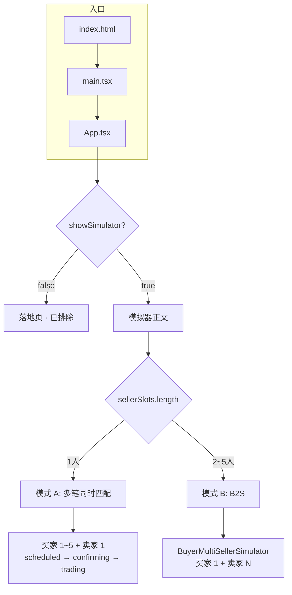
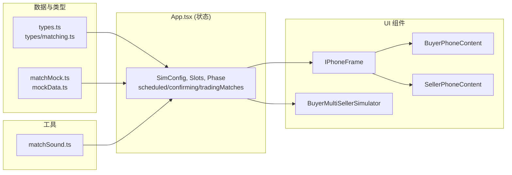
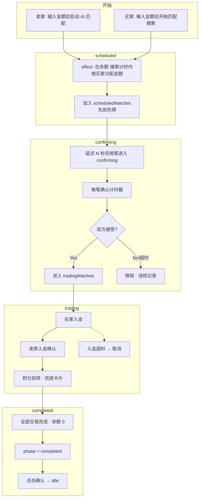
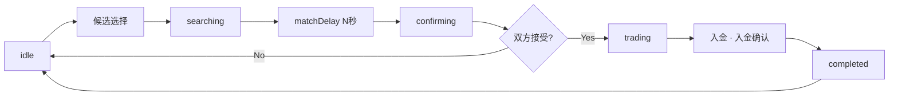
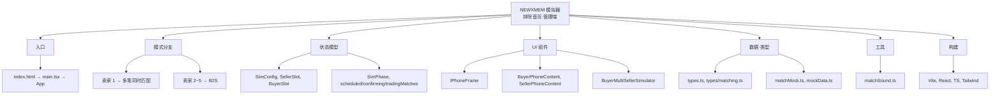

# NEWXMEM 项目思维导图（开发者用）

> **排除范围**：首页（落地页/介绍页）、管理端（计时器·延迟设置面板、纠纷解决按钮）  
> **说明对象**：模拟器正文 + 数据/类型/工具/构建

---

## 如何查看流程图

下方 Mermaid 代码块（```mermaid ... ```）可按以下方式查看。

| 环境 | 方法 |
|------|------|
| **GitHub** | 将此文件（`MINDMAP_DEV.md`）**推送到 GitHub** 后，在仓库中打开该文件即可**自动渲染为图表**。（GitHub 原生支持 `.md` 内的 Mermaid） |
| **Cursor / VS Code** | 1）打开 Markdown 预览：`Ctrl+Shift+V`（Windows）或 `Cmd+Shift+V`（Mac） 2）或安装 **Markdown Preview Mermaid Support** 扩展后在预览中查看图表 |
| **在线** | 打开 [Mermaid Live Editor](https://mermaid.live) → 从文档中复制 `flowchart` 代码块粘贴进去 → 实时渲染查看 |

**简要说明**
- **GitHub**：推送文件后在浏览器打开 `docs/MINDMAP_DEV.md`，滚动即可看到图表。
- **编辑器**：用 `Ctrl+Shift+V` 打开预览；若不显示图表，可安装 “Mermaid” 扩展。

---

## 1. 整体结构一览

```
NEWXMEM（排除首页·管理端）
├── 应用入口与路由
├── 模拟器模式分支
├── 状态模型（App 状态）
├── UI 组件
├── 数据与类型
├── 工具
└── 构建与配置
```

---

## 2. 应用入口与路由

- **index.html** → **main.tsx** → **App.tsx**
- `showSimulator` 状态
  - `false` → 落地页（首页）→ **已排除**
  - `true` → 实时匹配模拟器正文
- 顶部「← 返回介绍」将 `showSimulator = false` 切换回首页

---

## 3. 模拟器模式分支

- 按**卖家槽位数量** `sellerSlots.length` 分支
  - **1 个** → **模式 A：多笔同时匹配**
    - 买家 1～5 + 卖家 1
    - `useMultiSimultaneous === true`
    - 一名卖家与多名买家同时匹配（scheduled → confirming → trading）
  - **2～5 个** → **模式 B：B2S（BuyerMultiSellerSimulator）**
    - 一名买家与多名卖家匹配
    - 使用 `BuyerMultiSellerSimulator` 组件
    - 不使用 App 内单笔匹配逻辑

---

## 4. 状态模型（App.tsx）

### 4.1 配置（SimConfig）

- `matchDelaySeconds`、`confirmDelaySeconds`
- `sellerSearchTimerMinutes`、`buyerSearchTimerMinutes`、`buyerDepositTimerMinutes`
- `confirmTimerSeconds`
- `buyerDepositPhotoEnabled`、`sellerDepositPhotoEnabled`  
※ 在 UI 中修改的面板属于管理端（已排除），**使用这些值的逻辑**包含在模拟器正文中

### 4.2 卖家·买家槽位

- **SellerSlot**（一名卖家）
  - `user`、`amount`、`remainingAmount`、`started`、`clickedNew`
  - `searchTimerSeconds`、`currentPoints`、`violationHistory`
- **BuyerSlot**（一名买家）
  - `user`、`amount`、`started`、`depositDone`、`clickedNew`
  - `showCompletedScreen`、`lastCompletedAmount`、`searchTimerSeconds`
  - `currentPoints`、`matchConfirmed`、`violationHistory`

### 4.3 阶段（Phase）与单笔匹配

- **SimPhase**：`idle` | `searching` | `confirming` | `trading` | `completed`
- **单笔匹配**（1 卖家 + 1 买家流程）
  - `matchResult`、`matchedBuyerIndex`、`sellerConfirmed`、`sellerMatchConfirmed`
  - `confirmTimerSeconds`，以及取消/拒绝相关标志与消息

### 4.4 多笔同时匹配专用状态

- **ScheduledMatch**：`matchId`、`buyerIndex`、`amount`、`scheduledAt`
- **ConfirmingMatch**：`matchId`、`buyerIndex`、`amount`、`confirmTimerSeconds`、`buyerConfirmed`、`sellerConfirmed`
- **TradingMatch**：`matchId`、`buyerIndex`、`amount`、`buyerDepositDone`、`sellerConfirmed`、`canceledReason?`
- **数组**：`scheduledMatches`、`confirmingMatches`、`tradingMatches`
- **显示顺序**：`matchDisplayOrder`（matchId[]）
- **已完成列表**：`completedMultiMatches`
- **纠纷**：`activeDisputes`（用于显示与流程说明，解决按钮属于管理端已排除）

### 4.5 其他 UI·流程状态

- 取消/拒绝消息：`sellerCancelMessage`、`buyerCancelMessage`、`buyerCancelMessageForIndex`
- `confirmingInvalidated`、`rejectReason`、`sellerRejectDepositReason` 等
- `transferModalMatchId`、`completedSoldAmount`

---

## 5. UI 组件

### 5.1 框架

- **IPhoneFrame**
  - 买家/卖家手机 mock 框架
  - `variant`：`'buyer'` |（卖家）
  - `title`、`titleAction`（+、− 按钮）

### 5.2 买家·卖家画面

- **BuyerPhoneContent**
  - 单名买家画面：金额输入、搜索、匹配确认、入金、交易完成、取消/拒绝/纠纷
  - phase、计时器、接受/拒绝/入金不可等回调
- **SellerPhoneContent**
  - 单名卖家画面：金额输入、AI 匹配开始、确认阶段、入金确认·拒绝、交易完成
  - 单笔：`matchResult` 单条 / 多笔：`multiOrderedMatches`（按笔：confirming·trading·completed）

### 5.3 B2S 模式

- **BuyerMultiSellerSimulator**
  - 仅在卖家为 2～5 人时使用
  - 买家 1 + 卖家 N 的布局与匹配流程

### 5.4 模拟器内部辅助

- **HologramGrid**、**AIBot**：模拟器内装饰/演出用（仅在有需要时作为节点标注）

---

## 6. 数据与类型

### 6.1 类型（types.ts）

- **User**：`id`、`name`、`creditScore`、`bank`、`accountNumber`、`holder`、`points`
- **SimPhase**：`idle` | `searching` | `confirming` | `trading` | `completed`
- **MatchStatus**：IDLE、SEARCHING、MATCHED、TRANSFERRING、COMPLETED
- **Participant**：匹配对手信息（含金额）

### 6.2 类型（types/matching.ts）

- **MatchType**：`'1:1'` | `'1:N'`
- **BankInfo**、**MemberProfile**、**MockMatchResult**

### 6.3 数据（data/matchMock.ts）

- **sellerSessionUser**、**buyerSessionUser**（演示用固定用户）
- **createSellerUserForIndex(index)**、**createBuyerUserForIndex(index)**
- **computeMatchResult(sellerAmount, buyerAmount, sellerUser, buyerUser)** → 匹配结果对象

### 6.4 数据（data/mockData.ts）

- 其他 mock 数据（仅在模拟器/落地页引用时作为节点标注）

---

## 7. 工具

- **matchSound.ts**
  - `playMatchSoundLoop()`：匹配成功时播放
  - `stopMatchSound()`：确认时停止

---

## 8. 流程概要（排除首页·管理端）

### 模式 A：1 卖家 · N 买家（多笔同时匹配）

1. **idle**  
   卖家输入金额 → 设置 remainingAmount，买家开始搜索  
2. **scheduled**  
   effect 按买家分配金额 → 向 `scheduledMatches` 追加（先到先得）  
3. **confirming**  
   N 秒后按笔进入 `confirmingMatches` → 每笔计时器·接受/拒绝  
4. **trading**  
   仅双方接受的笔进入 `tradingMatches` → 入金·入金确认  
5. **completed**  
   无进行中交易且余额为 0 → phase `completed` → 点击「确认」后回到 idle

### 模式 B：1 买家 · N 卖家（B2S）

- 在 **BuyerMultiSellerSimulator** 内部处理
- 不使用 App 的单笔/多笔匹配状态

### 单笔匹配（App 内部，1 卖家 + 1 买家时的旧流程）

- idle → 候选选择 → **searching** →（matchDelay）→ **confirming** → 双方接受后 **trading** → 入金·入金确认 → **completed**

---

## 9. 构建与配置

- **Vite**（vite.config.ts）、**React 19**、**TypeScript**
- **Tailwind CSS**、**PostCSS**
- **脚本**：`dev`、`build`、`lint`、`preview`
- **部署**：参见 DEPLOY.md、GITHUB_배포_가이드.md 等（GitHub Actions 等）

---

## 10. 流程图（Mermaid Flowchart）

### 10.1 应用入口与模式分支



### 10.2 组件与数据流



### 10.3 模式 A：多笔同时匹配流程



### 10.4 单笔匹配流程（1 卖家 + 1 买家）



### 10.5 整体结构（层级）



---

本文档仅整理了**首页（落地页）**与**管理端（计时器设置面板、纠纷解决按钮）**以外的部分，供开发者入职与设计评审使用。
